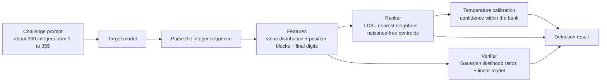

<div align="center">

# LM Fingerpoint Detector

**Identify the large language model behind an API from a few hundred first-instinct integers**

[简体中文](./README.md) · English

[](https://www.npmjs.com/package/lmfpd)
[](https://lm.ikale.io)
[](https://bun.sh)
[](./LICENSE)

[Web detector](https://lm.ikale.io) · [Usage](#usage) · [CLI Usage](#cli-usage) · [How It Works](#how-it-works) · [Acknowledgements](#acknowledgements)

</div>

---

## Introduction

An API relay or a third-party provider can claim to serve one model and actually serve another. LM Fingerpoint Detector checks this claim with a task that has no semantic content: the model writes about 300 integers from 1 to 355, each chosen by first instinct. The "random" numbers that a language model writes are not uniform. Each model has relatively stable preferences for values, ranges, and final digits. The detector compares this distribution with a reference bank and ranks the closest candidate models.

- **Two entry points**: the [website](https://lm.ikale.io) accepts pasted answers or calls an API directly. The `fpd` command line tool shows a live terminal interface and supports multiple rounds and JSON output.
- **Three protocols**: OpenAI Responses, Chat Completions, and Anthropic Messages. SSE streaming is the default.
- **Reference bank**: covers common model families such as GPT, Claude, Gemini, Grok, Qwen, and DeepSeek. The library page on the website shows the bank in read-only mode and can export it.
- **Traceable data maintenance**: `fpd sample`, `fpd enroll`, and `fpd retrain` collect, enroll, and refit offline. All failures and earlier attempts stay on record.

> [!IMPORTANT]
> A result is a **closed-set ranking within the reference bank**. A model that is not in the bank still gets a "closest" candidate. Ranking scores and confidence values are not proof of identity. To judge whether a channel is trustworthy, fix the request parameters, repeat several rounds, and use other evidence too.

## Usage

### Website

Open **[lm.ikale.io](https://lm.ikale.io)** and select a detection mode:

| Mode | Steps | Use case |
| --- | --- | --- |
| Manual | Copy the three generated challenges, send each one to the target model, and paste each answer back | You have a chat interface but no API key |
| API | Enter the Base URL, API key, model name, and protocol. The page collects the samples | You want to check an API channel |

Each answer must contain at least 80 valid integers and at least 55% of the requested count. If all three answers are valid, the page shows the ranking, verification scores, and confidence. If only one or two answers are valid, the page shows the ranking only.

In API mode, the same-origin `/api/proxy` endpoint forwards the requests, so the upstream does not need CORS support. The proxy accepts any provider, but only fully qualified domain names on the default HTTPS port. The browser keeps API settings in localStorage. Exported result images do not contain the key, the endpoint, or the answer text.

### Command line

No installation is necessary. Run the CLI with either runtime:

```sh
# Node.js 22 or later
npx lmfpd@latest -b https://api.example.com/v1 -k sk-xxx -m gpt-6-astra

# Bun 1.4.2 or later
bunx --bun lmfpd@latest -b https://api.example.com/v1 -k sk-xxx -m gpt-6-astra
```

See [CLI Usage](#cli-usage) for all options.

The CLI interface supports English, Simplified Chinese, Japanese, Korean, and French. Use `--lang en|zh|ja|ko|fr` (for example, `npx lmfpd@latest --lang ja --help`) or set `FPD_LANG`. The explicit flag overrides the environment variable; English is the default. The interface language does not select the challenge prompt language. See [CLI language](cli/README.md#cli-language) for details.

### Local development

```sh
bun install
bun run dev          # Sync data and start the web dev server (includes /api/proxy)
bun run typecheck    # Type-check the TypeScript code
bun run build        # Build the website into web/dist
bun run build:cli    # Pack the npm CLI into dist/fpd
bun run fpd --help   # Run the CLI from the repository
```

For deployment to Cloudflare Pages or GitHub Pages, see [docs/deployment.md](./docs/deployment.md).

## CLI Usage

```text
fpd [detect] [options]        Detect a model (default command)
fpd sample [options]          Collect a portable reference batch
fpd enroll DIR [options]      Validate a batch and write it to the reference bank
fpd retrain --data-dir DIR    Refit the verifier and confidence calibration offline
```

Use one of these forms. Each subcommand accepts `--help`.

```sh
npx lmfpd@latest [command] [options]          # Node.js 22 or later
bunx --bun lmfpd@latest [command] [options]   # Bun 1.4.2 or later
bun run fpd [command] [options]               # Inside this repository
```

The examples below use `npx`. With Bun, replace `npx lmfpd@latest` with `bunx --bun lmfpd@latest`.

### Detection

```sh
# Pass the connection settings explicitly
npx lmfpd@latest -b https://api.example.com/v1 -k sk-xxx -m gpt-6-astra

# Read BASE_URL, API_KEY, and MODEL from the environment; use Chat Completions with high reasoning effort
npx lmfpd@latest -a cc -e high

# Run 5 detection rounds
npx lmfpd@latest -n 5

# Strict mode without streaming; save the full report (credentials excluded)
npx lmfpd@latest -s -ns --timeout 180 --output result.json

# Analyze a saved report again without calling a model
npx lmfpd@latest --input result.json --json
```

| Option | Description | Default |
| --- | --- | --- |
| `-b, --baseurl URL` | Base URL or complete endpoint. The CLI adds the endpoint path if it is missing | `$BASE_URL` |
| `-k, --apikey KEY` | API key | `$API_KEY` |
| `-m, --model MODEL` | Model to request | `$MODEL` |
| `-a, --api TYPE` | `responses`, `chatcompletion` (or `cc`), or `message`. Any prefix works | `responses` |
| `-e, --effort LEVEL` | Reasoning effort, such as `low` or `high`, or any provider value | Not sent |
| `-ns, --no-stream` | Use a JSON response instead of SSE | SSE |
| `--timeout SECONDS` | Deadline for the first SSE byte. In JSON mode, deadline for the complete response | `120` |
| `--count N` | Samples per round, 1–3. Fewer than 3 samples give a ranking only | `3` |
| `-p, --parallel N` | Concurrent samples per round, 1–3, capped at `--count` | `3` |
| `-n, --repeat N` | Sequential detection rounds | `1` |
| `-s, --strict` | Disable automatic truncation and require 3 complete, valid answers | Off |
| `--challenges FILE` | Reuse saved challenges in every round. The count must match `--count` | Random |
| `--bank FILE` | Use a custom reference bank | Bundled bank |
| `--input FILE` | Analyze saved outputs offline | — |
| `--output FILE` | Save all rounds, samples, and results as JSON | — |
| `--json` | Write JSON to stdout instead of the terminal interface | — |
| `--no-update-check` | Disable background update checks. `FPD_NO_UPDATE_CHECK=1` does the same | On |

Command line options override environment variables. The default relaxed mode truncates each answer to its requested count. Each round waits for all its samples to finish before the next round starts. Detection does not retry automatically and never writes samples to the reference bank. Press `q` or `Ctrl+C` to cancel.

### Reference bank maintenance

Use this workflow to add reference data for a new model or channel. The workflow can run outside the repository. The data bundled with the CLI is read-only, so you must specify the destination with `--data-dir`. During interactive enrollment, the CLI can also detect this repository and ask for confirmation.

```sh
# 1. Sample: request the 36 fixed challenges. Missing settings open an interactive wizard
npx lmfpd@latest sample -b https://openrouter.ai/api/v1 -m vendor/model \
  --label model --family vendor --family-name Vendor --channel openrouter/vendor

# Resume an interrupted or partly failed batch with its original settings
npx lmfpd@latest sample --resume runs/<timestamp>

# 2. Enroll: do a dry run first, then validate the evidence, deduplicate, and rebuild the derived bank
npx lmfpd@latest enroll runs/<timestamp> --data-dir ./data --dry-run
npx lmfpd@latest enroll runs/<timestamp> --data-dir ./data

# 3. Retrain: refit the verifier and confidence calibration offline (requires uv; no model API calls)
npx lmfpd@latest retrain --data-dir ./data
```

Sampling stops reading an answer once it reaches 500 integers and truncates it there, so a looping model cannot run forever. Such answers are recorded as truncated and accepted. The limit is stored in the batch manifest, so older batches are not truncated when resumed or verified.

| Common option | Description |
| --- | --- |
| `--count N` | Number of fixed challenges, 1–36, default 36 |
| `-p, --parallel N` | Concurrent requests, 1–36, default 3 |
| `--max-attempts N` | Cumulative attempts per challenge, 1–20, default 3 |
| `--response-model ID` | Allowed response model. Repeat the option to accept aliases |
| `--subscription` | Subscription channel. The name must end in `-subscription`. `codex-subscription` uses the local Codex login |
| `--enroll --data-dir DIR` | Enroll immediately after sampling |
| `--json` | Noninteractive mode. Writes the final JSON to stdout |

Enrollment deduplicates by model, channel, condition, challenge, and text. If nested calibration fails during retraining, the existing `shared_detector.json` stays unchanged. Each training run saves its plan, metrics, and frozen source code under `.training/` in the data directory.

## How It Works



### 1. Challenges

Each round generates 3 challenges. The requested count of each challenge comes from 292–332 without repetition. Each challenge independently uses Chinese, English, Japanese, Korean, or French, and random equivalent templates in that language supply the wording. The prompt tells the model to choose each integer from 1 to 355 separately, by first instinct. The prompt forbids tools and code. It also forbids counting from 1, monotonic runs, arithmetic progressions, cycles, and other rule-made patterns. As a result, the sequence mainly shows the value preferences of the model itself.

The reference bank uses a different fixed set of 36 challenges: 3 challenges in each of 12 prompt environments, with requested counts from 218 to 333. The environments differ in whether a system prompt or a user prefix is present.

### 2. Parsing

The parser takes the longest run of integers from 1 to 355 in the answer. A letter ends a run. Let $N$ be the requested count. An answer with fewer than $\max(80, \lceil 0.55N \rceil)$ valid integers does not count. This rule removes refusals and badly truncated answers.

### 3. Features

Each answer becomes two feature blocks:

- **Value distribution**: the counts of the 355 values are smoothed and square-rooted (Hellinger embedding). Thus, the Euclidean distance between features is proportional to the Hellinger distance.

$$
\phi_i = \sqrt{\frac{c_i + \alpha}{\sum_{j=1}^{355} c_j + 355\alpha}}, \qquad \alpha = 0.5
$$

- **Positions and final digits**: the sequence is split into 4 equal blocks, each with 16 value bins. The distribution of final digits 0–9 is added, for $4 \times 16 + 10 = 74$ dimensions. These values are also smoothed and square-rooted.

Each block is standardized and normalized to unit length. The two blocks are then concatenated with weights of 0.75 and 0.25.

### 4. Ranker

The ranker calculates three scores for each model in the reference bank. It standardizes each score across the candidates and adds them with weights:

$$
s = 0.5\, z_{\text{LDA}} + 0.25\, z_{\text{kNN}} + 0.25\, z_{\text{centroid}}
$$

- **LDA**: a linear discriminant projection of the features of the first 128 integers, averaged over the answers.
- **Nearest neighbors**: the mean of the 7 smallest squared distances to the reference answers of the model, with the median over the answers.
- **Nuisance-free centroids**: the prompt environment shifts the whole distribution of a model. When the bank is built, SVD estimates a nuisance subspace of at most 2 dimensions from the mean offsets of the environments. At scoring time, the ranker removes this subspace and calculates the cosine similarity to each model centroid. The position-block features are also compared with the model templates of each environment.

The ranking score $s$ sets the candidate order.

### 5. Verifier

The verifier runs only when all three answers are valid. It projects the features into a low-dimensional space and calculates these features for each candidate:

- Gaussian log densities under three hypotheses: same model, other model, and a new model outside the bank
- The likelihood gain of each single answer
- The nearest-neighbor distance to the reference answers of the candidate
- The ranking-score margin of the candidate

A linear model combines these features into a verification score. If the top-ranked candidate differs from the candidate with the highest verification score, the result marks the disagreement.

### 6. Confidence calibration

The confidence is a temperature softmax within the reference bank:

$$
p_k = \frac{\exp(\tau s_k)}{\sum_j \exp(\tau s_j)}
$$

`fpd retrain` fits the temperature $\tau$ offline. It holds out each of the 12 environments, then each pair of environments, and refits the ranker 78 times. The held-out results give the estimate of $\tau$. The nested held-out binary NLL must be lower than a constant baseline, and the AUC must be greater than 0.75. If either check fails, retraining does not replace the current detector. $p_k$ is distributed only among the models in the bank. It is not the probability that the service really is that model.

### 7. Data files

| File | Content |
| --- | --- |
| `data/unified_reference.jsonl` | Reference batches. Each line holds the model, channel, request parameters, and answers |
| `data/unified_bank.json` | Statistics derived from the reference batches |
| `data/shared_detector.json` | Frozen ranker, verifier, and calibration, bound to the reference data by SHA-256 |
| `data/enrollment-suite.json` | The 36 fixed sampling challenges |

If the reference bank does not match the detector (for example, a custom bank from `--bank`), detection gives a legacy ranking only, without verification scores or confidence. See [data/README.md](./data/README.md) for the data change log.

## Project Structure

```text
.
├── cli/        fpd command line tool (Bun + Ink), published as the npm package lmfpd
├── web/        Detection website and read-only reference library (React + shadcn/ui + Tailwind CSS)
├── shared/     Challenge, parsing, and scoring code shared by the website and the CLI
├── data/       Reference data, derived bank, frozen detector, and fixed challenges
├── offline/    Offline retraining and calibration (Python, run with uv)
├── server/     Same-origin API proxy
├── functions/  Cloudflare Pages Functions entry point
├── api/        Vercel Functions entry point
└── docs/       Deployment guide
```

## Acknowledgements

Thanks to [xqy2006/ModelTrace](https://github.com/xqy2006/ModelTrace) for the algorithm ideas and part of the original data.

## License

[MIT](./LICENSE)
