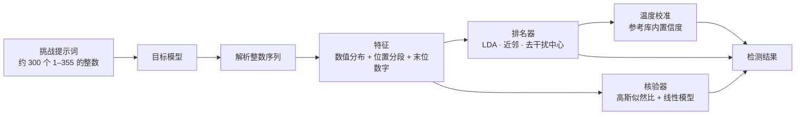

<div align="center">

# LM Fingerpoint Detector

**让模型随手写几百个整数，识别 API 背后的大语言模型**

简体中文 · [English](./README.en.md)

[](https://www.npmjs.com/package/lmfpd)
[](https://lm.ikale.io)
[](https://bun.sh)
[](./LICENSE)

[在线检测](https://lm.ikale.io) · [使用](#使用) · [CLI 使用](#cli-使用) · [原理](#原理) · [致谢](#致谢)

</div>

---

## 简介

中转站或第三方 API 声称提供某个模型，实际接入的可能是另一个模型。LM Fingerpoint Detector 用一个与语义无关的任务核对这一点：让模型凭第一反应写出约 300 个 1–355 之间的整数。语言模型写出的“随机数”并不均匀，每个模型偏好的数值、区间和末位数字相对稳定。检测器把这组分布与参考库比对，给出最接近的候选模型。

- **两种入口**：[网页](https://lm.ikale.io)支持手动粘贴和直连 API；命令行 `fpd` 提供实时终端界面、多轮检测和 JSON 输出。
- **三种协议**：OpenAI Responses、Chat Completions 和 Anthropic Messages，默认使用 SSE 流式响应。
- **参考库**：覆盖 GPT、Claude、Gemini、Grok、Qwen、DeepSeek 等常见模型家族。网页的参考库页面可以只读浏览和导出。
- **可追溯的数据维护**：`fpd sample`、`fpd enroll`、`fpd retrain` 依次完成采样、入库和离线重训。失败记录和旧尝试全部保留。

> [!IMPORTANT]
> 检测结果是**参考库内的封闭集合排序**。不在库中的模型也会得到一个“最像”的候选，排名分数和置信度都不是身份证明。判断渠道是否可信时，请固定请求参数、重复多轮，并结合其他证据。

## 使用

### 网页

打开 **[lm.ikale.io](https://lm.ikale.io)**，选择检测模式：

| 模式 | 操作 | 适用场景 |
| --- | --- | --- |
| 手动 | 复制页面生成的三道挑战，分别发给目标模型，再把回答粘贴回页面 | 只有聊天界面，没有 API Key |
| API | 填写 Base URL、API Key、模型名和协议，页面自动采样 | 检测 API 渠道 |

每条回答至少需要 80 个有效整数，且不少于要求数量的 55%。三条回答都有效时，页面给出排名、核验分数和置信度。只有一两条有效时，页面只给出排名。

API 模式的请求经同源 `/api/proxy` 转发，上游无需支持 CORS。代理不限制供应商，但只接受使用 HTTPS 默认端口的完整域名。API 设置保存在浏览器 localStorage 中。导出的结果图片不含密钥、接口地址和回答正文。

### 命令行

无需安装。任选一种运行时直接运行：

```sh
# Node.js ≥ 22
npx lmfpd@latest -b https://api.example.com/v1 -k sk-xxx -m gpt-6-astra

# Bun ≥ 1.4.2
bunx --bun lmfpd@latest -b https://api.example.com/v1 -k sk-xxx -m gpt-6-astra
```

完整参数见 [CLI 使用](#cli-使用)。

CLI 界面支持英文、简体中文、日文、韩文和法文。使用 `--lang en|zh|ja|ko|fr`（例如 `npx lmfpd@latest --lang ja --help`），或设置 `FPD_LANG`。显式参数优先于环境变量，默认英文。界面语言不控制挑战提示词的语言，详见 [CLI 语言说明](cli/README.md#cli-language)。

### 本地开发

```sh
bun install
bun run dev          # 同步数据并启动 Web 开发服务器（已接入 /api/proxy）
bun run typecheck    # TypeScript 类型检查
bun run build        # 构建网站到 web/dist
bun run build:cli    # 打包 npm CLI 到 dist/fpd
bun run fpd --help   # 在仓库内直接运行 CLI
```

部署到 Cloudflare Pages 或 GitHub Pages 的步骤见 [docs/deployment.md](./docs/deployment.md)。

## CLI 使用

```text
fpd [detect] [options]        检测（默认命令）
fpd sample [options]          采集一个可移植的参考批次
fpd enroll DIR [options]      校验批次并写入参考库
fpd retrain --data-dir DIR    离线重训核验器与置信度校准
```

运行方式任选其一。每个子命令都支持 `--help`。

```sh
npx lmfpd@latest [command] [options]          # Node.js ≥ 22
bunx --bun lmfpd@latest [command] [options]   # Bun ≥ 1.4.2
bun run fpd [command] [options]               # 在本仓库内
```

下文示例使用 `npx`。使用 Bun 时，把 `npx lmfpd@latest` 换成 `bunx --bun lmfpd@latest`。

### 检测

```sh
# 显式传入连接参数
npx lmfpd@latest -b https://api.example.com/v1 -k sk-xxx -m gpt-6-astra

# 从环境变量 BASE_URL、API_KEY、MODEL 读取连接参数；使用 Chat Completions 并设置推理强度
npx lmfpd@latest -a cc -e high

# 连续检测 5 轮
npx lmfpd@latest -n 5

# 严格模式、关闭流式响应，并保存完整报告（不含凭据）
npx lmfpd@latest -s -ns --timeout 180 --output result.json

# 离线重新分析已保存的报告，不请求模型
npx lmfpd@latest --input result.json --json
```

| 参数 | 说明 | 默认值 |
| --- | --- | --- |
| `-b, --baseurl URL` | Base URL 或完整端点；未写端点路径时自动补全 | `$BASE_URL` |
| `-k, --apikey KEY` | API Key | `$API_KEY` |
| `-m, --model MODEL` | 请求的模型名 | `$MODEL` |
| `-a, --api TYPE` | `responses`、`chatcompletion`（或 `cc`）、`message`，可只写前缀 | `responses` |
| `-e, --effort LEVEL` | 推理强度，例如 `low`、`high`，也可填供应商自定义值 | 不发送 |
| `-ns, --no-stream` | 使用普通 JSON 响应代替 SSE | SSE |
| `--timeout SECONDS` | SSE 首字节时限；JSON 模式下为完整响应时限 | `120` |
| `--count N` | 每轮样本数，1–3；少于 3 条时只给出排名 | `3` |
| `-p, --parallel N` | 每轮并发数，1–3，不超过 `--count` | `3` |
| `-n, --repeat N` | 顺序执行的检测轮数 | `1` |
| `-s, --strict` | 关闭自动截断，要求 3 条完整有效的回答 | 关闭 |
| `--challenges FILE` | 每轮复用保存的挑战，数量必须等于 `--count` | 随机生成 |
| `--bank FILE` | 使用自定义参考库 | 内置参考库 |
| `--input FILE` | 离线分析保存的输出 | — |
| `--output FILE` | 把所有轮次、样本和结果保存为 JSON | — |
| `--json` | 向 stdout 输出 JSON，代替终端界面 | — |
| `--no-update-check` | 关闭后台更新检查，也可设置 `FPD_NO_UPDATE_CHECK=1` | 开启 |

命令行参数优先于环境变量。默认的宽松模式把每条回答截断到要求的数量。每轮等全部样本结束后才开始下一轮。检测不自动重试，也不会把样本写入参考库。按 `q` 或 `Ctrl+C` 可以取消。

### 维护参考库

以下流程为新模型或新渠道补充参考数据，可在仓库外运行。CLI 随包附带的数据只读，写入目标必须用 `--data-dir` 显式指定。交互式入库时，CLI 也可以识别本仓库并请求确认。

```sh
# 1. 采样：逐一请求 36 道固定挑战；缺少的设置会打开交互向导
npx lmfpd@latest sample -b https://openrouter.ai/api/v1 -m vendor/model \
  --label model --family vendor --family-name Vendor --channel openrouter/vendor

# 中断或部分失败后，按原设置续采
npx lmfpd@latest sample --resume runs/<timestamp>

# 2. 入库：先预检，再校验原始证据、去重并重建派生库
npx lmfpd@latest enroll runs/<timestamp> --data-dir ./data --dry-run
npx lmfpd@latest enroll runs/<timestamp> --data-dir ./data

# 3. 重训：离线拟合核验器与置信度校准（需要 uv，不请求模型 API）
npx lmfpd@latest retrain --data-dir ./data
```

采样时，回答一旦达到 500 个整数就停止读取并截断，防止模型无限循环输出。这类回答按截断记录并正常采用。上限写在批次清单中，旧批次续采和校验时不截断。

| 常用参数 | 说明 |
| --- | --- |
| `--count N` | 固定挑战数量，1–36，默认 36 |
| `-p, --parallel N` | 并发请求数，1–36，默认 3 |
| `--max-attempts N` | 每道挑战的累计尝试上限，1–20，默认 3 |
| `--response-model ID` | 允许的响应模型名；重复传入可接受别名 |
| `--subscription` | 订阅渠道，名称必须以 `-subscription` 结尾；`codex-subscription` 使用本机 Codex 登录 |
| `--enroll --data-dir DIR` | 采样结束后立即入库 |
| `--json` | 非交互模式，向 stdout 输出最终 JSON |

入库按模型、渠道、条件、题目和文本去重。重训的嵌套校准未通过时，现有的 `shared_detector.json` 保持不变。每次训练的计划、指标和冻结源码保存在数据目录的 `.training/` 下。

## 原理



### 1. 挑战

每轮生成 3 道挑战。每道挑战要求的数量从 292–332 中不重复抽取，并独立随机选用中文、英文、日文、韩文或法文，措辞由该语言的多组等价模板随机组合。提示词要求模型逐个位置凭第一反应选择 1–355 的整数。提示词禁止模型调用工具或代码，也禁止从 1 开始计数、单调递增或递减、等差、循环等规则化模式。因此，得到的序列主要反映模型自身的取值偏好。

参考库使用另一套固定的 36 道挑战：12 种提示环境各 3 道，要求数量为 218–333。提示环境的区别在于是否附加系统提示词或用户前缀。

### 2. 解析

解析器从回答中取出最长的一段 1–355 整数；字母会打断一段序列。设 $N$ 为要求数量，有效整数少于 $\max(80, \lceil 0.55N \rceil)$ 的回答不参与评分。拒答和严重截断的回答因此被排除。

### 3. 特征

每条回答转换为两块特征：

- **数值分布**：355 个取值的计数经平滑后开平方（Hellinger 嵌入）。这样，特征之间的欧氏距离与 Hellinger 距离成正比。

$$
\phi_i = \sqrt{\frac{c_i + \alpha}{\sum_{j=1}^{355} c_j + 355\alpha}}, \qquad \alpha = 0.5
$$

- **位置与末位**：序列均分为 4 段，每段统计 16 个取值区间；再加上末位数字 0–9 的分布，共 $4 \times 16 + 10 = 74$ 维，同样平滑后开平方。

两块特征分别标准化并单位化，再按 0.75 : 0.25 的权重拼接。

### 4. 排名器

排名器对参考库中的每个模型计算三项分数，在候选之间标准化后加权求和：

$$
s = 0.5\, z_{\text{LDA}} + 0.25\, z_{\text{kNN}} + 0.25\, z_{\text{centroid}}
$$

- **LDA**：对前 128 个整数的特征做线性判别投影，多条回答取平均。
- **近邻**：取与该模型参考回答最近的 7 个平方距离的平均值，多条回答取中位数。
- **去干扰中心**：提示环境会让同一模型的分布整体偏移。建库时，SVD 从各环境的均值偏移中估计至多 2 维的干扰子空间。评分时先投影掉该子空间，再计算与各模型中心的余弦相似度。位置分段特征还会与各环境下的模型模板比较。

排名分数 $s$ 决定候选顺序。

### 5. 核验器

核验器只在三条回答都有效时运行。它把特征投影到低维空间，并为每个候选计算以下特征：

- 在“同一模型”“其他模型”“库外模型”三种假设下的高斯对数密度
- 单条回答的似然增益
- 与该模型参考回答的近邻距离
- 该候选的排名分数领先幅度

线性模型把这些特征合成核验分数。如果排名第一的候选与核验分数最高的候选不同，结果会标注分歧。

### 6. 置信度校准

置信度是参考库内的温度 softmax：

$$
p_k = \frac{\exp(\tau s_k)}{\sum_j \exp(\tau s_j)}
$$

`fpd retrain` 离线拟合温度 $\tau$。拟合过程先逐一留出 12 种环境，再两两留出，共重新拟合 78 次排名器，并用留出结果估计 $\tau$。嵌套留出的二元 NLL 必须低于常数基线，且 AUC 必须大于 0.75；否则，重训不替换现有检测器。$p_k$ 只在参考库模型之间分配，不代表“确实是该模型”的概率。

### 7. 数据文件

| 文件 | 内容 |
| --- | --- |
| `data/unified_reference.jsonl` | 参考批次，每行包含模型、渠道、请求参数和回答 |
| `data/unified_bank.json` | 由参考批次派生的统计库 |
| `data/shared_detector.json` | 冻结的排名器、核验器和校准参数，用 SHA-256 绑定参考数据 |
| `data/enrollment-suite.json` | 36 道固定采样挑战 |

如果参考库与检测器不匹配（例如用 `--bank` 指定自定义库），检测只给出传统排名，不计算核验分数和置信度。数据变更记录见 [data/README.md](./data/README.md)。

## 项目结构

```text
.
├── cli/        命令行 fpd（Bun + Ink），发布为 npm 包 lmfpd
├── web/        检测网站与只读参考库（React + shadcn/ui + Tailwind CSS）
├── shared/     Web 与 CLI 共用的挑战、解析和评分算法
├── data/       参考数据、派生库、冻结检测器和固定挑战
├── offline/    离线重训与校准（Python，由 uv 运行）
├── server/     同源 API 代理实现
├── functions/  Cloudflare Pages Functions 入口
├── api/        Vercel Functions 入口
└── docs/       部署说明
```

## 致谢

感谢 [xqy2006/ModelTrace](https://github.com/xqy2006/ModelTrace) 提供了算法思路参考和部分原始数据。

## 许可证

[MIT](./LICENSE)
