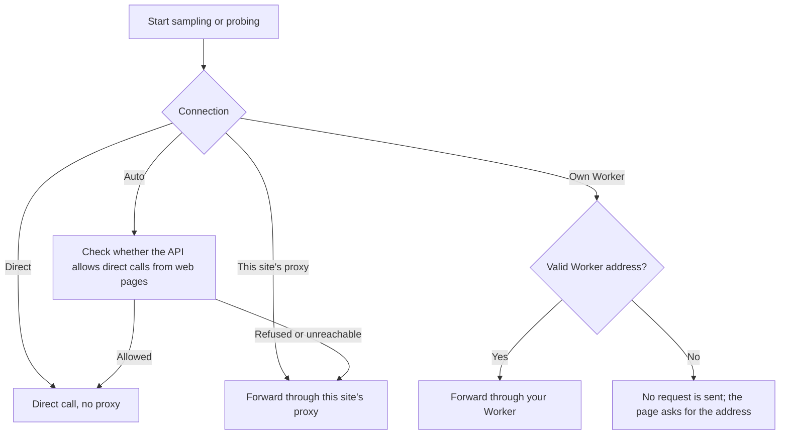

The browser's cross-origin restriction (CORS) decides whether a web page may read the response of an API. Many relays and third-party APIs do not allow web pages to call them directly, so the requests have to go through a server. That server is the forwarding proxy. On a direct call, your API key passes through no third party. Through a proxy, your API key, the challenges, and the model's answers pass through that server on their way to the API.

## The four connection modes

"Connection" at the bottom of the API configuration has four options, with one sentence below the selected option that explains it. It is a browser-level setting. It applies to all profiles and is not written to exported configuration files.

| Option | Where requests go |
| --- | --- |
| Auto (default) | Before each sampling or probing run, checks the API once: direct if it allows web pages to call it, otherwise through this site's proxy |
| Direct | Always from the browser straight to the API, without a proxy. Requests fail if the API does not allow cross-origin calls from web pages |
| This site's proxy | Always through this site's proxy, `/api/proxy` |
| Own Worker | Always through the Worker you deployed |

The route is fixed when a run starts. Changing the connection mode during a run does not affect the requests in progress.

## The check in Auto mode

Auto checks once before each sampling or probing run. During the check, the main button shows "Checking connection…" and the configuration is locked. The check takes at most about 8 seconds; if the API does not respond, Auto treats it as not allowed and uses this site's proxy. The result is not kept, so the next run checks again.

The check does not use up quota. Its request carries a dummy API key (`sk-cors-check`) and an empty body `{}`, and the API rejects it before it runs any model, so no model runs and no tokens are billed.

The check does not leak your real API key either, because the real key appears only in the requests that follow. Neither the check request nor a direct request carries cookies or a Referer, and neither follows redirects, so a redirect cannot send the API key elsewhere.

If the check reads any HTTP status from the API, even a rejection, web pages can call it directly. If it cannot read one, the API may refuse web pages, or the address or network may be wrong. The browser cannot tell these apart, and Auto uses this site's proxy in both cases.

## When a direct call fails

When a direct request fails at the network level, the page names both possible causes: the API address or the network is wrong, or the API does not allow cross-origin calls from web pages (CORS). The browser cannot tell which one it is. Check the address and your network first; if they are fine, switch the connection to "This site's proxy" or "Own Worker". A failed direct request is not switched to a proxy automatically.

## This site's proxy and your own Worker

<Tabs items={['This site', 'Own Worker']}>
  <Tab value="This site">
    The proxy this site provides, at `/api/proxy`, implemented as a Cloudflare Pages server function. It does not store API keys or log request content. If you deploy the website yourself on a static host without server functions, such as GitHub Pages, this proxy does not exist and you need to choose "Own Worker"; Auto also uses this proxy when the API does not allow direct calls.
  </Tab>
  <Tab value="Own Worker">
    Enter the address of the Worker you deployed, for example `https://fingerpoint-api-proxy.<subdomain>.workers.dev`. Only HTTPS is accepted. For local testing, `http://localhost` or `http://127.0.0.1` also works. The address is saved as you type, and if you clear it or change it to an invalid address, the saved address is cleared too. Requests are then not sent: the page shows a message, focuses the address field, and does not switch to this site's proxy.

    After you choose "Own Worker", a "Check proxy" button and a "Deploy your own Worker" area appear below, with two entries, "Deploy to Cloudflare" and "Open in the Playground". For how they differ and the steps, see [Own Worker proxy](../deployment/worker.mdx). How your Worker handles the API key depends on the code you deployed, and this site cannot confirm it.

    Using your own Worker on lm.ikale.io needs no settings change. When the page is not on lm.ikale.io (for example, a site you deployed yourself), add the page's origin to the Worker's `ALLOWED_ORIGINS`, and the "Deploy your own Worker" area shows a hint when this applies. An origin is the protocol, domain, and port of a URL, such as `https://example.com`. For a page hosted on GitHub Pages, the origin is `https://<username>.github.io`, without the repository name. For how to set it, see [Own Worker proxy](../deployment/worker.mdx).
  </Tab>
</Tabs>

"Check proxy" sends one GET health check to the Worker address you entered, without the API key. The result applies only to that address:

| Result | Possible cause | What to do |
| --- | --- | --- |
| The Worker is available | It returned `{"service":"fingerpoint-api-proxy"}` | Nothing |
| The address responded, but this page cannot read the response | The address is not a Fingerpoint proxy, or the Worker's `ALLOWED_ORIGINS` does not include the origin of the current page | Check that the address is the Worker you deployed, then add the current page's origin to `ALLOWED_ORIGINS` |
| The address responded, but it is not a Fingerpoint proxy | The address points to another service | Check that you entered the Worker's address |
| The address cannot be reached | A DNS, certificate, or network problem | Check the address and your network |

## What the browser stores

The connection mode and the Worker address are stored in the browser, and so are the API configuration and the API key. None of this is uploaded to this site. Your API key leaves the browser only when a request is sent, to the API or to a forwarding proxy, as the selected connection mode decides. Clearing this site's browser data removes all of it, and the connection mode returns to Auto.
