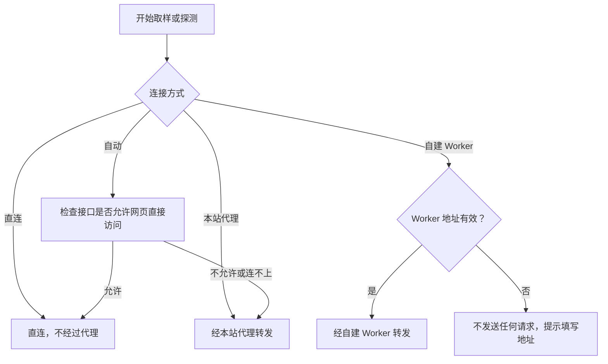

浏览器的跨域限制（CORS）决定网页能否读取某个接口的响应。很多中转站和第三方 API 不允许网页直接访问，这时请求要经一台服务器转发，这台服务器就是转发代理。直连时 API Key 不经过任何第三方；经代理时，API Key、挑战和模型回答会经过这台服务器，再送到接口。

## 四种连接方式

API 配置底部的“连接方式”有四个选项，选中的选项下方有一句说明。它是浏览器级设置，对所有预设生效，不写入导出的配置文件。

| 选项 | 请求去向 |
| --- | --- |
| 自动（默认） | 每次取样或探测开始前检查一次接口：允许网页直接访问时直连，否则经本站代理转发 |
| 直连 | 总是由浏览器直接请求接口，不经过代理。接口不允许网页跨域访问时，请求会失败 |
| 本站代理 | 总是经本站代理 `/api/proxy` 转发 |
| 自建 Worker | 总是经你自己部署的 Worker 转发 |

每次运行开始时确定请求去向，运行中修改连接方式不影响正在进行的请求。

## 自动模式的检查

“自动”在每次取样或探测开始前检查一次，检查期间主按钮显示“检查连接…”，配置暂时锁定。检查最长约 8 秒；接口没有响应时按不允许处理，改经本站代理。检查结果不保存，下一次运行重新检查。

检查不会消耗额度。它发出的请求带的是假 API Key（`sk-cors-check`），请求体是空的 `{}`，接口会在运行模型之前拒绝它，所以不运行模型，也不产生 token 费用。

检查也不会泄露你的真 API Key，真 Key 只出现在之后的正式请求里。检查请求和直连请求都不带 Cookie 和来源页面（Referer），也不跟随重定向，API Key 不会随重定向发往别处。

只要读到接口返回的任何 HTTP 状态（哪怕是拒绝），就说明网页可以直连。读不到时，原因可能是接口不允许网页访问，也可能是地址或网络有问题；这两种情况浏览器无法区分，“自动”都会改经本站代理。

## 直连失败时

直连请求在网络层失败时，页面提示两种可能：接口地址或网络有问题，或者接口不允许网页跨域访问（CORS）。浏览器无法确定是哪一种。先检查地址和网络；确认无误后，可以把连接方式改为“本站代理”或“自建 Worker”。失败的直连请求不会自动改走代理。

## 本站代理与自建 Worker

<Tabs items={['本站代理', '自建 Worker']}>
  <Tab value="本站代理">
    本站提供的代理，地址是 `/api/proxy`，由 Cloudflare Pages 的服务器函数实现，不保存 API Key，也不记录请求内容。你自己部署的网页如果放在 GitHub Pages 这类没有服务器函数的静态站点上，就没有这个代理，需要选择“自建 Worker”；“自动”在接口不允许直连时也会用到这个代理。
  </Tab>
  <Tab value="自建 Worker">
    填写你部署的 Worker 地址，例如 `https://fingerpoint-api-proxy.<subdomain>.workers.dev`。只接受 HTTPS，本机调试时也可以用 `http://localhost` 或 `http://127.0.0.1`。地址随输入自动保存，清空或改成无效地址时，已保存的地址也会清除。这时请求不会发送，页面提示并聚焦地址输入框，也不会改走本站代理。

    选择“自建 Worker”后，下方出现“检查代理”按钮和“部署自己的 Worker”区，有“部署到 Cloudflare”和“在 Playground 中打开”两个入口，区别和步骤见[自建 Worker 代理](../deployment/worker.mdx)。你的 Worker 怎么处理 API Key，取决于你部署的代码，本站无法确认。

    在 lm.ikale.io 上使用自己的 Worker，不需要改任何设置。页面不在 lm.ikale.io 上时（例如你自己部署的站点），要把页面的来源加入 Worker 的 `ALLOWED_ORIGINS`，“部署自己的 Worker”区会在需要时给出提示。来源指网址里协议、域名和端口的部分，例如 `https://example.com`。托管在 GitHub Pages 上的网页，来源是 `https://<用户名>.github.io`，不带仓库名。设置方法见[自建 Worker 代理](../deployment/worker.mdx)。
  </Tab>
</Tabs>

“检查代理”向填写的 Worker 地址发一次 GET 健康检查，不携带 API Key，结果只对应这个地址：

| 结果 | 可能的原因 | 怎么办 |
| --- | --- | --- |
| Worker 可用 | 收到了 `{"service":"fingerpoint-api-proxy"}` | 无需处理 |
| 该地址有响应，但不允许本页面读取 | 填写的不是 Fingerpoint 代理，或者 Worker 的 `ALLOWED_ORIGINS` 没有包含当前页面的来源 | 先确认地址是你部署的 Worker，再把当前页面的来源加入 `ALLOWED_ORIGINS` |
| 该地址有响应，但不是 Fingerpoint 代理 | 地址指向了别的服务 | 确认填写的是 Worker 的地址 |
| 无法连接该地址 | DNS、证书或网络有问题 | 检查地址和网络 |

## 保存在浏览器里的内容

连接方式和 Worker 地址保存在浏览器本地，API 配置和 API Key 也保存在浏览器本地。这些内容不会上传到本站；API Key 只在发送请求时，按所选的连接方式发给接口或转发代理。清除本站的浏览器数据就会全部删除，连接方式恢复为“自动”。
